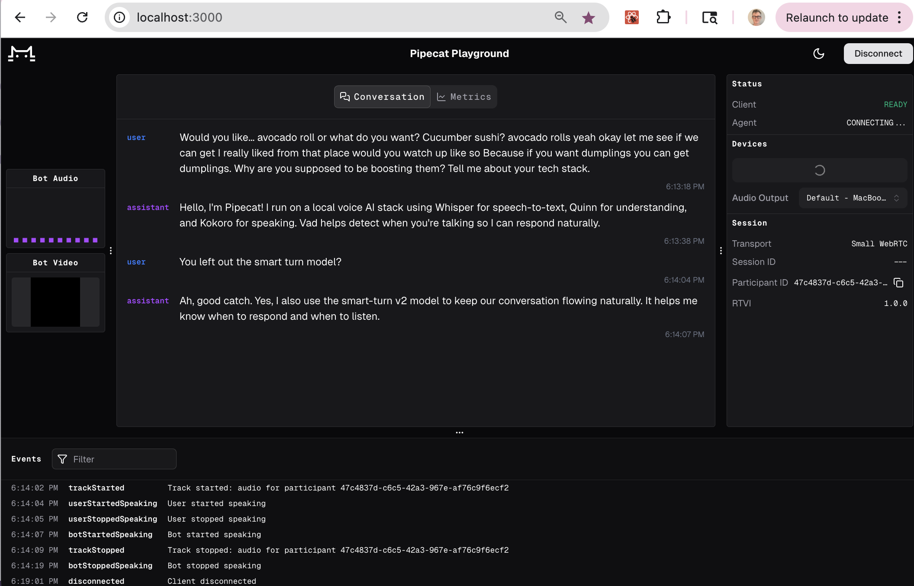

# Local voice agents on Linux with Pipecat (NVIDIA CUDA)



Pipecat is an open-source, vendor-neutral framework for building real-time voice (and video) AI applications.

This repository contains an example of a voice agent running with all local models on Linux, accelerated by an NVIDIA GPU. It is a CUDA port of the original macOS/Apple-Silicon version: the two models that ran on the Apple GPU (Metal) now run on the NVIDIA GPU (CUDA) instead, and everything else is unchanged.

The [server/bot.py](server/bot.py) file uses these models:

  - Silero VAD — runs on CPU (ONNX). This is the same on macOS; Pipecat's Silero VAD has no GPU path.
  - smart-turn v2 — runs on the **GPU** (PyTorch, auto-selects CUDA).
  - Whisper STT — runs on the **GPU** via faster-whisper / CTranslate2 (`device="cuda"`).
  - Gemma3n 4B (or any model) — served by an external OpenAI-compatible LLM server.
  - Kokoro TTS — runs on the **GPU** via the PyTorch `kokoro` package (`device="cuda"`).

But you can swap any of them out for other models, or completely reconfigure the pipeline. It's easy to add tool calling, MCP server integrations, use parallel pipelines to do async inference alongside the voice conversations, add custom processing steps, configure interrupt handling to work differently, etc.

The bot and web client here communicate using a low-latency, local, serverless WebRTC connection. For more information on serverless WebRTC, see the Pipecat [SmallWebRTCTransport docs](https://docs.pipecat.ai/server/services/transport/small-webrtc) and this [article](https://www.daily.co/blog/you-dont-need-a-webrtc-server-for-your-voice-agents/). You could switch over to a different Pipecat transport (for example, a WebSocket-based transport), but WebRTC is the best choice for realtime audio.

For a deep dive into voice AI, including network transport, optimizing for latency, and notes on designing tool calling and complex workflows, see the [Voice AI & Voice Agents Illustrated Guide](https://voiceaiandvoiceagents.com/).

# Requirements

  - Linux with an NVIDIA GPU.
  - Recent NVIDIA driver and CUDA runtime. faster-whisper (CTranslate2) needs cuDNN and cuBLAS available on the system; PyTorch's CUDA wheels bundle most of what `kokoro` and smart-turn need.
  - Python 3.12.

# Models and dependencies

Silero VAD, smart-turn, Whisper, and Kokoro all run inside the Pipecat process. When the agent code starts, it will download any model weights that aren't already cached, so first startup can take some time.

The LLM service in this bot uses the OpenAI-compatible chat completion HTTP API. So you will need to run a local OpenAI-compatible LLM server. On Linux, good options include:

  - [vLLM](https://github.com/vllm-project/vllm) — `vllm serve <model>` exposes an OpenAI-compatible endpoint on port 8000.
  - [Ollama](https://ollama.com/) — serves an OpenAI-compatible API on port 11434 (`/v1`).
  - [llama.cpp](https://github.com/ggml-org/llama.cpp) — `llama-server` exposes an OpenAI-compatible endpoint.
  - [LM Studio](https://lmstudio.ai/) — also has a Linux build with the same "Developer" HTTP server.

Point `base_url` in [server/bot.py](server/bot.py) at whichever server you run (the default is `http://127.0.0.1:1234/v1`), and set `model` to the model name that server exposes.

# Run the voice agent

The core voice agent code lives in [server/bot.py](server/bot.py). The Kokoro TTS service is a small custom in-process service in [server/tts_kokoro_cuda.py](server/tts_kokoro_cuda.py) built on the [kokoro](https://github.com/hexgrad/kokoro) PyTorch package.

> Note: on macOS, Kokoro was run in a subprocess worker to avoid Apple Metal threading conflicts. That constraint does not exist on CUDA, so this port runs Kokoro in-process on the GPU.

Note that the first time you start the bot it will take some time to initialize the models and download weights. It can be 30 seconds or more before the bot is fully ready to go. Subsequent startups will be much faster.

```shell
cd server/
```

If you're using uv

```
uv run bot.py
```

If you're using pip

```
python3.12 -m venv venv
source venv/bin/activate

# Install a CUDA-enabled PyTorch build first if your default index doesn't provide one, e.g.:
# pip install torch --index-url https://download.pytorch.org/whl/cu124

pip install -r requirements.txt

python bot.py
```

You can sanity-check that the GPU is being used with `nvidia-smi` while the bot is running — you should see the python process holding GPU memory.

After you run the first time and have all the models cached, you can set the HF_HUB_OFFLINE environment variable to prevent the Hugging Face libraries from going to the network and checking for model updates. This makes the initial bot startup and first conversation turn a lot faster.

```
HF_HUB_OFFLINE=1 uv run bot.py
```

# Start the web client

The web client is a React app. You can connect to your local agent using any client that can negotiate a serverless WebRTC connection. The client in this repo is based on [voice-ui-kit](https://github.com/pipecat-ai/voice-ui-kit) and just uses that library's standard debug console template.

```shell
cd client/

npm i

npm run dev

# Navigate to URL shown in terminal in your web browser
```
